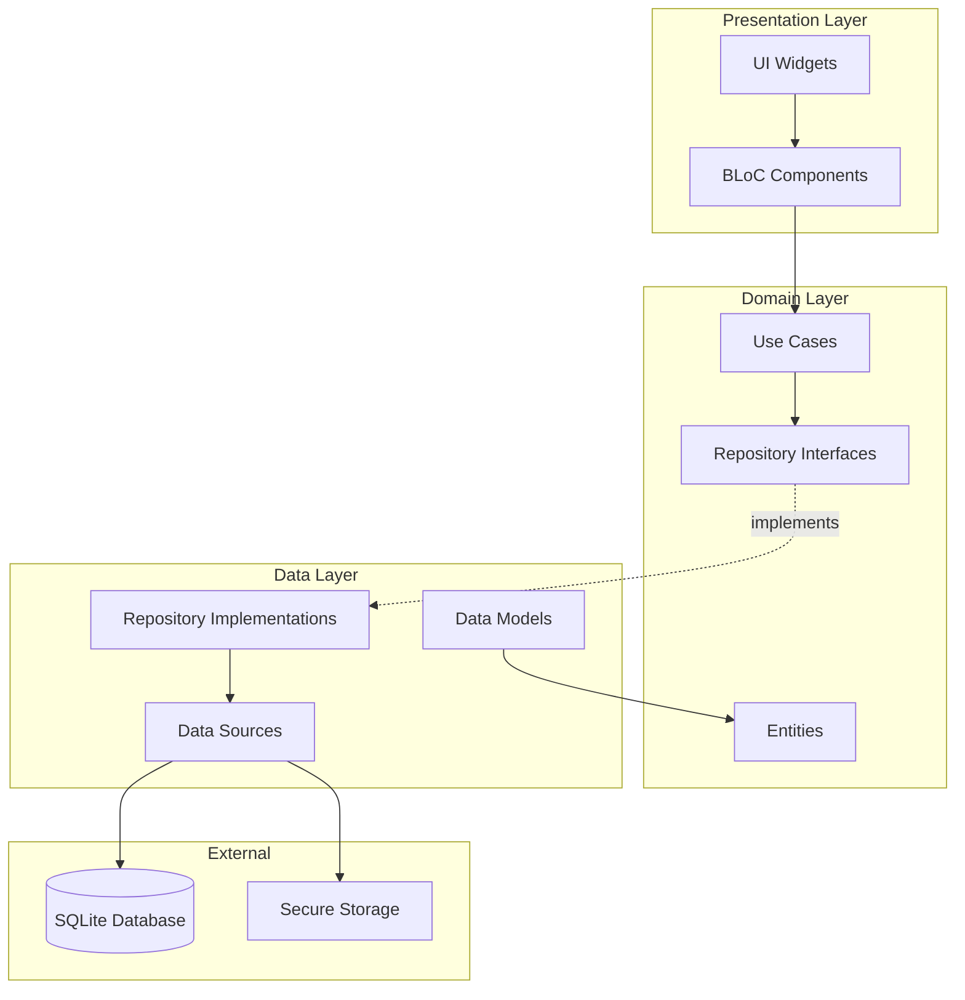
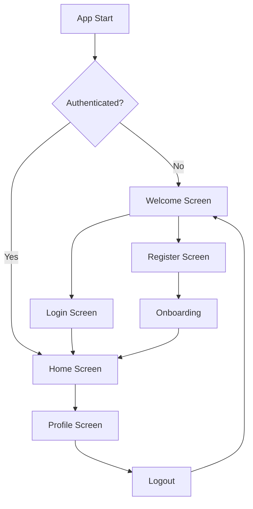

# Design Document

## Overview

This design document outlines the comprehensive transformation of the finance application from a single-user system to a secure, multi-user application with proper authentication and clean architecture. The redesign focuses on three main pillars:

1. **User Authentication & Authorization**: Implementing secure login, registration, and session management
2. **Clean Architecture**: Restructuring the codebase to follow clean architecture principles with clear separation of concerns
3. **Multi-User Data Isolation**: Ensuring complete data separation between users with proper database schema changes

The architecture will follow the **Clean Architecture** pattern with three distinct layers (Presentation, Domain, Data), use **BLoC** for state management, and implement **dependency injection** using GetIt. Security will be handled through **flutter_secure_storage** for tokens and **bcrypt** for password hashing.

## Architecture

### High-Level Architecture Diagram



### Layer Responsibilities

#### Presentation Layer
- **UI Widgets**: Flutter widgets that display data and capture user input
- **BLoC Components**: Business logic components that manage UI state
- **Responsibilities**: User interaction, state management, navigation

#### Domain Layer
- **Entities**: Core business objects (User, Transfer, Expense, etc.)
- **Use Cases**: Application-specific business rules
- **Repository Interfaces**: Abstract contracts for data access
- **Responsibilities**: Business logic, validation, domain rules

#### Data Layer
- **Repository Implementations**: Concrete implementations of repository interfaces
- **Data Sources**: Direct interaction with databases and storage
- **Data Models**: Database-specific models with serialization
- **Responsibilities**: Data persistence, external API calls, caching

### Dependency Flow

```
Presentation → Domain ← Data
```

- Presentation depends on Domain
- Data depends on Domain
- Domain depends on nothing (pure Dart)

## Components and Interfaces

### 1. Authentication System

#### Auth BLoC

```dart
// Events
abstract class AuthEvent {}
class AuthLoginRequested extends AuthEvent {
  final String email;
  final String password;
  final bool rememberMe;
}
class AuthRegisterRequested extends AuthEvent {
  final String username;
  final String email;
  final String password;
}
class AuthLogoutRequested extends AuthEvent {}
class AuthCheckRequested extends AuthEvent {}

// States
abstract class AuthState {}
class AuthInitial extends AuthState {}
class AuthLoading extends AuthState {}
class AuthAuthenticated extends AuthState {
  final User user;
}
class AuthUnauthenticated extends AuthState {}
class AuthError extends AuthState {
  final String message;
}
```

#### Auth Repository Interface (Domain Layer)

```dart
abstract class AuthRepository {
  Future<Either<Failure, User>> login(String email, String password);
  Future<Either<Failure, User>> register(String username, String email, String password);
  Future<Either<Failure, void>> logout();
  Future<Either<Failure, User>> getCurrentUser();
  Future<Either<Failure, bool>> isAuthenticated();
  Future<Either<Failure, void>> resetPassword(String email);
  Future<Either<Failure, void>> changePassword(String oldPassword, String newPassword);
}
```

#### Auth Data Source (Data Layer)

```dart
abstract class AuthLocalDataSource {
  Future<UserModel> login(String email, String password);
  Future<UserModel> register(String username, String email, String password);
  Future<void> logout();
  Future<UserModel?> getCachedUser();
  Future<void> cacheUser(UserModel user);
  Future<void> cacheAuthToken(String token);
  Future<String?> getAuthToken();
  Future<void> clearAuthData();
}
```

### 2. User Management

#### User Entity (Domain Layer)

```dart
class User {
  final int id;
  final String username;
  final String email;
  final DateTime createdAt;
  final DateTime? updatedAt;
  final String? profilePicturePath;
  
  const User({
    required this.id,
    required this.username,
    required this.email,
    required this.createdAt,
    this.updatedAt,
    this.profilePicturePath,
  });
}
```

#### User Model (Data Layer)

```dart
class UserModel extends User {
  const UserModel({
    required super.id,
    required super.username,
    required super.email,
    required super.createdAt,
    super.updatedAt,
    super.profilePicturePath,
  });
  
  factory UserModel.fromMap(Map<String, dynamic> map) { ... }
  Map<String, dynamic> toMap() { ... }
  factory UserModel.fromEntity(User user) { ... }
}
```

### 3. Session Management

#### Session Manager

```dart
class SessionManager {
  final SecureStorage _secureStorage;
  final Duration sessionDuration;
  
  Future<void> createSession(String userId, String token);
  Future<bool> isSessionValid();
  Future<void> refreshSession();
  Future<void> clearSession();
  Future<String?> getSessionToken();
}
```

### 4. Database Schema Changes

#### New Users Table

```sql
CREATE TABLE users (
  id INTEGER PRIMARY KEY AUTOINCREMENT,
  username TEXT NOT NULL UNIQUE,
  email TEXT NOT NULL UNIQUE,
  password_hash TEXT NOT NULL,
  profile_picture_path TEXT,
  created_at INTEGER NOT NULL,
  updated_at INTEGER,
  last_login INTEGER
);
```

#### Updated Tables with User Association

```sql
-- Add user_id to fund_box
ALTER TABLE fund_box ADD COLUMN user_id INTEGER NOT NULL DEFAULT 1;
ALTER TABLE fund_box ADD FOREIGN KEY (user_id) REFERENCES users(id) ON DELETE CASCADE;

-- Add user_id to transfers
ALTER TABLE transfers ADD COLUMN user_id INTEGER NOT NULL DEFAULT 1;
ALTER TABLE transfers ADD FOREIGN KEY (user_id) REFERENCES users(id) ON DELETE CASCADE;

-- Add user_id to incoming
ALTER TABLE incoming ADD COLUMN user_id INTEGER NOT NULL DEFAULT 1;
ALTER TABLE incoming ADD FOREIGN KEY (user_id) REFERENCES users(id) ON DELETE CASCADE;

-- Add user_id to expenses
ALTER TABLE expenses ADD COLUMN user_id INTEGER NOT NULL DEFAULT 1;
ALTER TABLE expenses ADD FOREIGN KEY (user_id) REFERENCES users(id) ON DELETE CASCADE;
```

#### Sessions Table

```sql
CREATE TABLE sessions (
  id INTEGER PRIMARY KEY AUTOINCREMENT,
  user_id INTEGER NOT NULL,
  token TEXT NOT NULL UNIQUE,
  created_at INTEGER NOT NULL,
  expires_at INTEGER NOT NULL,
  last_activity INTEGER NOT NULL,
  FOREIGN KEY (user_id) REFERENCES users(id) ON DELETE CASCADE
);
```

#### Password Reset Tokens Table

```sql
CREATE TABLE password_reset_tokens (
  id INTEGER PRIMARY KEY AUTOINCREMENT,
  user_id INTEGER NOT NULL,
  token TEXT NOT NULL UNIQUE,
  created_at INTEGER NOT NULL,
  expires_at INTEGER NOT NULL,
  used INTEGER NOT NULL DEFAULT 0,
  FOREIGN KEY (user_id) REFERENCES users(id) ON DELETE CASCADE
);
```

### 5. Repository Pattern Implementation

#### Transfer Repository Interface (Domain)

```dart
abstract class TransferRepository {
  Future<Either<Failure, TransferRecord>> createTransfer({
    required int userId,
    required String recipientName,
    required double amountUsd,
    double? convertedAmountUsd,
    double? amountSypAtExchange,
    double? manualUsdToSypRate,
    DateTime? transactionDate,
  });
  
  Future<Either<Failure, List<TransferRecord>>> getTransfersByUser(int userId);
  Future<Either<Failure, void>> updateTransfer(TransferRecord record);
  Future<Either<Failure, void>> deleteTransfer(int id, int userId, {bool refund = false});
}
```

#### Transfer Repository Implementation (Data)

```dart
class TransferRepositoryImpl implements TransferRepository {
  final TransferLocalDataSource localDataSource;
  final FundBoxLocalDataSource fundBoxDataSource;
  
  TransferRepositoryImpl({
    required this.localDataSource,
    required this.fundBoxDataSource,
  });
  
  @override
  Future<Either<Failure, TransferRecord>> createTransfer({...}) async {
    try {
      // Verify user has sufficient funds
      final fundBox = await fundBoxDataSource.getFundBoxByUser(userId);
      if (fundBox.balanceUsd < amountUsd) {
        return Left(InsufficientFundsFailure());
      }
      
      // Create transfer and update fund box in transaction
      final transfer = await localDataSource.createTransfer(...);
      return Right(transfer);
    } catch (e) {
      return Left(DatabaseFailure(e.toString()));
    }
  }
  
  // ... other methods
}
```

### 6. Use Cases

#### Login Use Case

```dart
class LoginUseCase {
  final AuthRepository repository;
  
  LoginUseCase(this.repository);
  
  Future<Either<Failure, User>> call(LoginParams params) async {
    // Validate email format
    if (!_isValidEmail(params.email)) {
      return Left(ValidationFailure('Invalid email format'));
    }
    
    // Validate password
    if (params.password.isEmpty) {
      return Left(ValidationFailure('Password cannot be empty'));
    }
    
    // Attempt login
    return await repository.login(params.email, params.password);
  }
  
  bool _isValidEmail(String email) {
    return RegExp(r'^[\w-\.]+@([\w-]+\.)+[\w-]{2,4}$').hasMatch(email);
  }
}

class LoginParams {
  final String email;
  final String password;
  final bool rememberMe;
  
  LoginParams({
    required this.email,
    required this.password,
    this.rememberMe = false,
  });
}
```

#### Create Transfer Use Case

```dart
class CreateTransferUseCase {
  final TransferRepository transferRepository;
  final AuthRepository authRepository;
  
  CreateTransferUseCase({
    required this.transferRepository,
    required this.authRepository,
  });
  
  Future<Either<Failure, TransferRecord>> call(CreateTransferParams params) async {
    // Get current user
    final userResult = await authRepository.getCurrentUser();
    if (userResult.isLeft()) {
      return Left(UnauthorizedFailure());
    }
    
    final user = userResult.getOrElse(() => throw Exception());
    
    // Validate amount
    if (params.amountUsd <= 0) {
      return Left(ValidationFailure('Amount must be greater than zero'));
    }
    
    // Validate converted amount doesn't exceed total
    if (params.convertedAmountUsd != null && 
        params.convertedAmountUsd! > params.amountUsd) {
      return Left(ValidationFailure('Converted amount cannot exceed total amount'));
    }
    
    // Create transfer
    return await transferRepository.createTransfer(
      userId: user.id,
      recipientName: params.recipientName,
      amountUsd: params.amountUsd,
      convertedAmountUsd: params.convertedAmountUsd,
      amountSypAtExchange: params.amountSypAtExchange,
      manualUsdToSypRate: params.manualUsdToSypRate,
      transactionDate: params.transactionDate,
    );
  }
}
```

### 7. Dependency Injection Setup

```dart
final sl = GetIt.instance;

Future<void> initializeDependencies() async {
  // External
  final database = await AppDatabase().database;
  sl.registerSingleton<Database>(database);
  
  final secureStorage = const FlutterSecureStorage();
  sl.registerSingleton<FlutterSecureStorage>(secureStorage);
  
  // Data Sources
  sl.registerLazySingleton<AuthLocalDataSource>(
    () => AuthLocalDataSourceImpl(
      database: sl(),
      secureStorage: sl(),
    ),
  );
  
  sl.registerLazySingleton<TransferLocalDataSource>(
    () => TransferLocalDataSourceImpl(database: sl()),
  );
  
  // ... other data sources
  
  // Repositories
  sl.registerLazySingleton<AuthRepository>(
    () => AuthRepositoryImpl(localDataSource: sl()),
  );
  
  sl.registerLazySingleton<TransferRepository>(
    () => TransferRepositoryImpl(
      localDataSource: sl(),
      fundBoxDataSource: sl(),
    ),
  );
  
  // ... other repositories
  
  // Use Cases
  sl.registerLazySingleton(() => LoginUseCase(sl()));
  sl.registerLazySingleton(() => RegisterUseCase(sl()));
  sl.registerLazySingleton(() => LogoutUseCase(sl()));
  sl.registerLazySingleton(() => CreateTransferUseCase(
    transferRepository: sl(),
    authRepository: sl(),
  ));
  
  // ... other use cases
  
  // BLoCs
  sl.registerFactory(() => AuthBloc(
    loginUseCase: sl(),
    registerUseCase: sl(),
    logoutUseCase: sl(),
    getCurrentUserUseCase: sl(),
  ));
  
  sl.registerFactory(() => TransferBloc(
    createTransferUseCase: sl(),
    getTransfersUseCase: sl(),
    updateTransferUseCase: sl(),
    deleteTransferUseCase: sl(),
  ));
  
  // ... other BLoCs
}
```

## Data Models

### User Data Model

```dart
class UserModel extends User {
  const UserModel({
    required super.id,
    required super.username,
    required super.email,
    required super.createdAt,
    super.updatedAt,
    super.profilePicturePath,
  });
  
  factory UserModel.fromMap(Map<String, dynamic> map) {
    return UserModel(
      id: map['id'] as int,
      username: map['username'] as String,
      email: map['email'] as String,
      createdAt: DateTime.fromMillisecondsSinceEpoch(map['created_at'] as int),
      updatedAt: map['updated_at'] != null 
        ? DateTime.fromMillisecondsSinceEpoch(map['updated_at'] as int)
        : null,
      profilePicturePath: map['profile_picture_path'] as String?,
    );
  }
  
  Map<String, dynamic> toMap() {
    return {
      'id': id,
      'username': username,
      'email': email,
      'created_at': createdAt.millisecondsSinceEpoch,
      'updated_at': updatedAt?.millisecondsSinceEpoch,
      'profile_picture_path': profilePicturePath,
    };
  }
}
```

### Session Model

```dart
class SessionModel {
  final int id;
  final int userId;
  final String token;
  final DateTime createdAt;
  final DateTime expiresAt;
  final DateTime lastActivity;
  
  const SessionModel({
    required this.id,
    required this.userId,
    required this.token,
    required this.createdAt,
    required this.expiresAt,
    required this.lastActivity,
  });
  
  bool get isExpired => DateTime.now().isAfter(expiresAt);
  bool get isActive => !isExpired;
  
  factory SessionModel.fromMap(Map<String, dynamic> map) { ... }
  Map<String, dynamic> toMap() { ... }
}
```

## Error Handling

### Failure Classes

```dart
abstract class Failure {
  final String message;
  const Failure(this.message);
}

class DatabaseFailure extends Failure {
  const DatabaseFailure(super.message);
}

class AuthenticationFailure extends Failure {
  const AuthenticationFailure(super.message);
}

class ValidationFailure extends Failure {
  const ValidationFailure(super.message);
}

class UnauthorizedFailure extends Failure {
  const UnauthorizedFailure() : super('Unauthorized access');
}

class InsufficientFundsFailure extends Failure {
  const InsufficientFundsFailure() : super('Insufficient funds');
}

class NetworkFailure extends Failure {
  const NetworkFailure(super.message);
}
```

### Error Handling Pattern

```dart
// In BLoC
final result = await useCase(params);
result.fold(
  (failure) => emit(ErrorState(failure.message)),
  (data) => emit(SuccessState(data)),
);

// In UI
BlocListener<TransferBloc, TransferState>(
  listener: (context, state) {
    if (state is TransferError) {
      ScaffoldMessenger.of(context).showSnackBar(
        SnackBar(content: Text(state.message)),
      );
    }
  },
  child: ...,
)
```

## Testing Strategy

### Unit Tests

1. **Use Case Tests**: Test business logic in isolation
   - Test validation rules
   - Test success and failure paths
   - Mock repository dependencies

2. **Repository Tests**: Test data layer logic
   - Test data source interactions
   - Test error handling
   - Mock data sources

3. **BLoC Tests**: Test state management
   - Test event handling
   - Test state emissions
   - Mock use cases

### Integration Tests

1. **Database Tests**: Test database operations
   - Test migrations
   - Test CRUD operations
   - Test transactions

2. **Authentication Flow Tests**: Test complete auth flows
   - Test login/register/logout
   - Test session management
   - Test password reset

### Widget Tests

1. **UI Component Tests**: Test individual widgets
   - Test user interactions
   - Test state changes
   - Mock BLoCs

### Example Test Structure

```dart
// Use Case Test
void main() {
  late LoginUseCase useCase;
  late MockAuthRepository mockRepository;
  
  setUp(() {
    mockRepository = MockAuthRepository();
    useCase = LoginUseCase(mockRepository);
  });
  
  group('LoginUseCase', () {
    test('should return User when credentials are valid', () async {
      // Arrange
      final user = User(...);
      when(mockRepository.login(any, any))
        .thenAnswer((_) async => Right(user));
      
      // Act
      final result = await useCase(LoginParams(
        email: 'test@example.com',
        password: 'password123',
      ));
      
      // Assert
      expect(result, Right(user));
      verify(mockRepository.login('test@example.com', 'password123'));
    });
    
    test('should return ValidationFailure when email is invalid', () async {
      // Act
      final result = await useCase(LoginParams(
        email: 'invalid-email',
        password: 'password123',
      ));
      
      // Assert
      expect(result, isA<Left<ValidationFailure, User>>());
    });
  });
}
```

## Security Considerations

### Password Security

1. **Hashing**: Use bcrypt with salt rounds of 12
2. **Validation**: Enforce strong password requirements
   - Minimum 8 characters
   - At least one uppercase letter
   - At least one lowercase letter
   - At least one number
   - Optional: special characters

### Token Security

1. **Storage**: Use flutter_secure_storage for tokens
2. **Generation**: Use cryptographically secure random tokens
3. **Expiration**: Implement token expiration (7 days default)
4. **Refresh**: Implement token refresh mechanism

### Session Security

1. **Timeout**: Implement inactivity timeout (30 minutes)
2. **Single Device**: Optional single device login
3. **Logout**: Clear all session data on logout

### Data Isolation

1. **User ID Validation**: Always validate user ID in queries
2. **Query Filtering**: Add WHERE user_id = ? to all queries
3. **Authorization Checks**: Verify user owns data before operations

## Migration Strategy

### Phase 1: Database Migration

1. Create users table
2. Create sessions table
3. Create password_reset_tokens table
4. Add user_id columns to existing tables
5. Create default user
6. Associate existing data with default user

### Phase 2: Architecture Refactoring

1. Create domain layer structure
2. Create data layer structure
3. Implement repository pattern
4. Implement use cases
5. Set up dependency injection

### Phase 3: Authentication Implementation

1. Implement auth data sources
2. Implement auth repository
3. Implement auth use cases
4. Implement auth BLoC
5. Create login/register UI

### Phase 4: Multi-User Support

1. Update all repositories to filter by user ID
2. Update all use cases to include user context
3. Update all BLoCs to handle user-specific data
4. Update UI to show user-specific data

### Phase 5: Testing & Polish

1. Write unit tests
2. Write integration tests
3. Perform security audit
4. Add onboarding flow
5. Add profile management

## UI/UX Changes

### New Screens

1. **Welcome Screen**: First screen with login/register options
2. **Login Screen**: Email and password fields, remember me, forgot password
3. **Register Screen**: Username, email, password, confirm password
4. **Password Reset Screen**: Email input and token verification
5. **Profile Screen**: User info, statistics, settings, logout
6. **Onboarding Screen**: Tutorial for new users

### Updated Screens

1. **Home Screen**: Add user profile icon in app bar
2. **All Data Screens**: Filter data by current user automatically
3. **Settings Screen**: Add account management options

### Navigation Flow



## Performance Considerations

1. **Lazy Loading**: Use lazy singleton for repositories
2. **Caching**: Cache user data in memory
3. **Indexing**: Add database indexes on user_id columns
4. **Query Optimization**: Use prepared statements
5. **BLoC Disposal**: Properly dispose BLoCs to prevent memory leaks

## Localization Updates

Add new translation keys for authentication:

```dart
'welcome': 'مرحباً',
'login': 'تسجيل الدخول',
'register': 'إنشاء حساب',
'username': 'اسم المستخدم',
'email': 'البريد الإلكتروني',
'password': 'كلمة المرور',
'confirm_password': 'تأكيد كلمة المرور',
'forgot_password': 'نسيت كلمة المرور؟',
'remember_me': 'تذكرني',
'logout': 'تسجيل الخروج',
'profile': 'الملف الشخصي',
'account_settings': 'إعدادات الحساب',
'change_password': 'تغيير كلمة المرور',
'invalid_credentials': 'بيانات الدخول غير صحيحة',
'registration_success': 'تم إنشاء الحساب بنجاح',
'weak_password': 'كلمة المرور ضعيفة',
'email_already_exists': 'البريد الإلكتروني مستخدم بالفعل',
'username_already_exists': 'اسم المستخدم مستخدم بالفعل',
```

## Dependencies to Add

```yaml
dependencies:
  # State Management
  flutter_bloc: ^8.1.3
  equatable: ^2.0.5
  
  # Dependency Injection
  get_it: ^7.6.4
  
  # Functional Programming
  dartz: ^0.10.1
  
  # Security
  flutter_secure_storage: ^9.0.0
  crypto: ^3.0.3
  
  # Password Hashing (use FFI or platform channels)
  bcrypt: ^1.1.3
  
  # Utilities
  uuid: ^4.2.1
```

## Conclusion

This design provides a comprehensive roadmap for transforming the finance application into a secure, scalable, multi-user system. The clean architecture approach ensures maintainability and testability, while the authentication system provides robust security. The migration strategy allows for incremental implementation without disrupting existing functionality.
