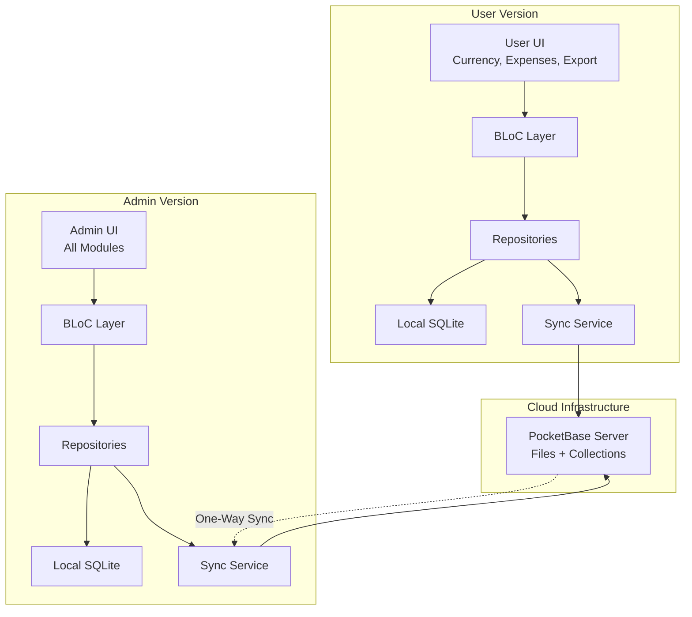
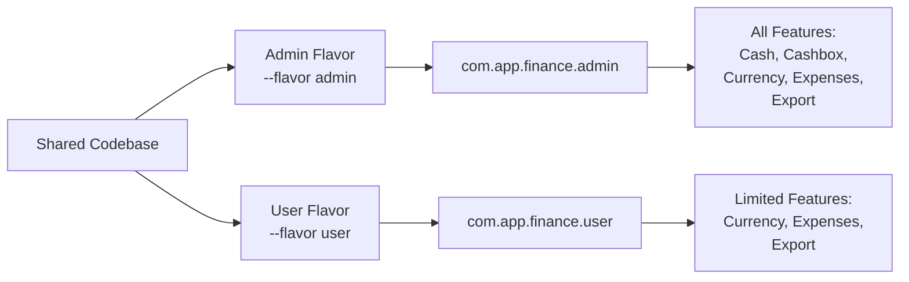
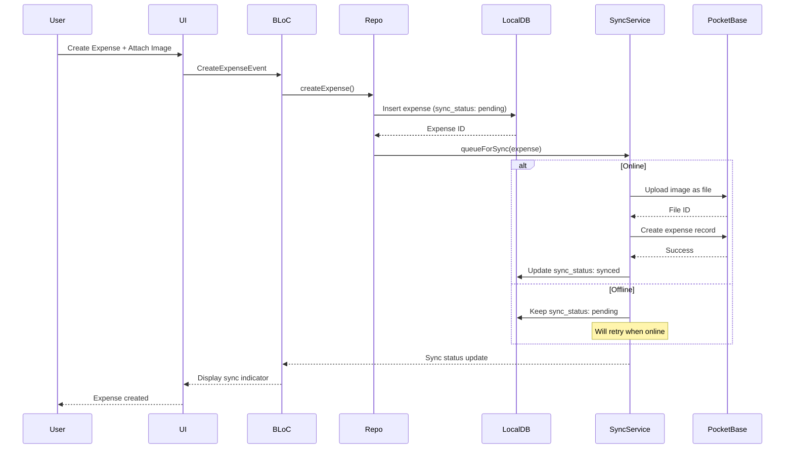

# Design Document

## Overview

This design document outlines the transformation of the finance application into two distinct versions: an **Admin Version** with full functionality and a **Public/User Version** with limited modules. The system implements one-way data synchronization where user-submitted expenses (invoices) automatically sync to the Admin version, while admin-created data remains isolated.

The architecture introduces:

1. **Build Flavors**: Separate Admin and User builds with conditional feature compilation
2. **Cloud Storage Integration**: PocketBase for invoice images and data with hybrid local-cloud architecture
3. **Synchronization Service**: One-way sync from User → Admin with offline support
4. **Enhanced Data Models**: Sync status tracking and user attribution
5. **Role-Based Access Control**: Admin-only features and data access patterns

## Architecture

### High-Level System Architecture




### Build Flavor Architecture



### Data Flow: User Creates Expense with Invoice




## Components and Interfaces

### 1. Build Flavor Configuration

#### Flavor Enum

```dart
enum AppFlavor {
  admin,
  user;
  
  bool get isAdmin => this == AppFlavor.admin;
  bool get isUser => this == AppFlavor.user;
}
```

#### Flavor Configuration Service

```dart
class FlavorConfig {
  final AppFlavor flavor;
  final String appName;
  final String applicationId;
  final bool enableCashModule;
  final bool enableCashboxModule;
  final bool enableCurrencyModule;
  final bool enableExpensesModule;
  final bool enableExportModule;
  
  const FlavorConfig({
    required this.flavor,
    required this.appName,
    required this.applicationId,
    required this.enableCashModule,
    required this.enableCashboxModule,
    required this.enableCurrencyModule,
    required this.enableExpensesModule,
    required this.enableExportModule,
  });
  
  static FlavorConfig? _instance;
  
  static FlavorConfig get instance {
    assert(_instance != null, 'FlavorConfig must be initialized');
    return _instance!;
  }
  
  static void initialize(AppFlavor flavor) {
    _instance = flavor == AppFlavor.admin
        ? const FlavorConfig(
            flavor: AppFlavor.admin,
            appName: 'Finance Admin',
            applicationId: 'com.app.finance.admin',
            enableCashModule: true,
            enableCashboxModule: true,
            enableCurrencyModule: true,
            enableExpensesModule: true,
            enableExportModule: true,
          )
        : const FlavorConfig(
            flavor: AppFlavor.user,
            appName: 'Finance',
            applicationId: 'com.app.finance.user',
            enableCashModule: false,
            enableCashboxModule: false,
            enableCurrencyModule: true,
            enableExpensesModule: true,
            enableExportModule: true,
          );
  }
}
```


### 2. Cloud Storage Service

#### Storage Service Interface

```dart
abstract class StorageService {
  Future<Either<Failure, String>> uploadInvoiceImage({
    required String localPath,
    required int userId,
    required int expenseId,
  });
  
  Future<Either<Failure, String>> getInvoiceImageUrl(String fileId);
  
  Future<Either<Failure, File>> downloadInvoiceImage(String fileId);
  
  Future<Either<Failure, void>> deleteInvoiceImage(String fileId);
  
  Future<bool> isOnline();
}
```

#### PocketBase Storage Implementation

```dart
class PocketBaseStorageService implements StorageService {
  final PocketBase _pb;
  final Connectivity _connectivity;
  
  PocketBaseStorageService({
    required PocketBase pb,
    required Connectivity connectivity,
  }) : _pb = pb, _connectivity = connectivity;
  
  @override
  Future<Either<Failure, String>> uploadInvoiceImage({
    required String localPath,
    required int userId,
    required int expenseId,
  }) async {
    try {
      if (!await isOnline()) {
        return Left(NetworkFailure('No internet connection'));
      }
      
      final file = File(localPath);
      if (!await file.exists()) {
        return Left(StorageFailure('File not found'));
      }
      
      // Compress image before upload
      final compressedFile = await _compressImage(file);
      
      // Upload to PocketBase as multipart file
      final formData = {
        'user_id': userId.toString(),
        'expense_id': expenseId.toString(),
        'file': await MultipartFile.fromFile(
          compressedFile.path,
          filename: 'invoice_${expenseId}_${DateTime.now().millisecondsSinceEpoch}.jpg',
        ),
      };
      
      // Create record in 'invoice_files' collection with file attachment
      final record = await _pb.collection('invoice_files').create(body: formData);
      
      // Return the file ID for later retrieval
      return Right(record.id);
    } catch (e) {
      return Left(StorageFailure(e.toString()));
    }
  }
  
  @override
  Future<Either<Failure, String>> getInvoiceImageUrl(String fileId) async {
    try {
      final record = await _pb.collection('invoice_files').getOne(fileId);
      final fileName = record.data['file'] as String;
      
      // Generate PocketBase file URL
      final url = _pb.getFileUrl(record, fileName);
      return Right(url);
    } catch (e) {
      return Left(StorageFailure(e.toString()));
    }
  }
  
  @override
  Future<bool> isOnline() async {
    final result = await _connectivity.checkConnectivity();
    return result != ConnectivityResult.none;
  }
  
  Future<File> _compressImage(File file) async {
    final bytes = await file.readAsBytes();
    final image = img.decodeImage(bytes);
    if (image == null) return file;
    
    // Resize if too large (max 1920px width)
    final resized = image.width > 1920
        ? img.copyResize(image, width: 1920)
        : image;
    
    // Compress to JPEG with 85% quality
    final compressed = img.encodeJpg(resized, quality: 85);
    
    // Save to temp file
    final tempDir = await getTemporaryDirectory();
    final tempFile = File('${tempDir.path}/compressed_${DateTime.now().millisecondsSinceEpoch}.jpg');
    await tempFile.writeAsBytes(compressed);
    
    return tempFile;
  }
}
```


### 3. Synchronization Service

#### Sync Status Enum

```dart
enum SyncStatus {
  pending,
  syncing,
  synced,
  failed;
  
  bool get isPending => this == SyncStatus.pending;
  bool get isSyncing => this == SyncStatus.syncing;
  bool get isSynced => this == SyncStatus.synced;
  bool get isFailed => this == SyncStatus.failed;
}
```

#### Sync Service Interface

```dart
abstract class SyncService {
  Future<Either<Failure, void>> syncExpense(Expense expense);
  
  Future<Either<Failure, void>> syncPendingExpenses();
  
  Future<Either<Failure, List<Expense>>> fetchAdminExpenses();
  
  Stream<SyncStatus> watchSyncStatus(int expenseId);
  
  Future<void> startAutoSync();
  
  Future<void> stopAutoSync();
}
```

#### Cloud Sync Service Implementation

```dart
class CloudSyncService implements SyncService {
  final PocketBase _pb;
  final StorageService _storageService;
  final ExpenseLocalDataSource _localDataSource;
  final AuthRepository _authRepository;
  final FlavorConfig _flavorConfig;
  
  Timer? _autoSyncTimer;
  final _syncStatusController = StreamController<Map<int, SyncStatus>>.broadcast();
  
  CloudSyncService({
    required PocketBase pb,
    required StorageService storageService,
    required ExpenseLocalDataSource localDataSource,
    required AuthRepository authRepository,
    required FlavorConfig flavorConfig,
  }) : _pb = pb,
       _storageService = storageService,
       _localDataSource = localDataSource,
       _authRepository = authRepository,
       _flavorConfig = flavorConfig;
  
  @override
  Future<Either<Failure, void>> syncExpense(Expense expense) async {
    try {
      // Only sync from user version
      if (_flavorConfig.flavor != AppFlavor.user) {
        return Right(null);
      }
      
      // Get current user
      final userResult = await _authRepository.getCurrentUser();
      if (userResult.isLeft()) {
        return Left(UnauthorizedFailure());
      }
      final user = userResult.getOrElse(() => throw Exception());
      
      // Update local status to syncing
      await _localDataSource.updateSyncStatus(expense.id!, SyncStatus.syncing);
      _emitSyncStatus(expense.id!, SyncStatus.syncing);
      
      // Upload invoice image if exists
      String? fileId;
      if (expense.invoiceFilePath != null) {
        final uploadResult = await _storageService.uploadInvoiceImage(
          localPath: expense.invoiceFilePath!,
          userId: user.id,
          expenseId: expense.id!,
        );
        
        if (uploadResult.isLeft()) {
          await _localDataSource.updateSyncStatus(expense.id!, SyncStatus.failed);
          _emitSyncStatus(expense.id!, SyncStatus.failed);
          return Left(uploadResult.fold((l) => l, (r) => throw Exception()));
        }
        
        fileId = uploadResult.getOrElse(() => throw Exception());
      }
      
      // Sync expense to PocketBase 'expenses' collection
      await _pb.collection('expenses').create(body: {
        'user_id': user.id,
        'username': user.username,
        'user_email': user.email,
        'local_expense_id': expense.id,
        'description': expense.description,
        'price_usd': expense.priceUsd,
        'price_syp': expense.priceSyp,
        'price_try': expense.priceTry,
        'invoice_status': expense.invoiceStatus.index,
        'invoice_file_id': fileId,
        'expense_date': expense.expenseDate.toIso8601String(),
        'created_at': expense.createdAt.toIso8601String(),
        'synced_at': DateTime.now().toIso8601String(),
      });
      
      // Update local status to synced
      await _localDataSource.updateSyncStatus(expense.id!, SyncStatus.synced);
      await _localDataSource.updateCloudFileId(expense.id!, fileId);
      _emitSyncStatus(expense.id!, SyncStatus.synced);
      
      return Right(null);
    } catch (e) {
      if (expense.id != null) {
        await _localDataSource.updateSyncStatus(expense.id!, SyncStatus.failed);
        _emitSyncStatus(expense.id!, SyncStatus.failed);
      }
      return Left(SyncFailure(e.toString()));
    }
  }
  
  @override
  Future<Either<Failure, void>> syncPendingExpenses() async {
    try {
      final pendingExpenses = await _localDataSource.getExpensesBySyncStatus(
        SyncStatus.pending,
      );
      
      for (final expense in pendingExpenses) {
        await syncExpense(expense);
        // Add delay to avoid rate limiting
        await Future.delayed(const Duration(milliseconds: 500));
      }
      
      return Right(null);
    } catch (e) {
      return Left(SyncFailure(e.toString()));
    }
  }
  
  @override
  Future<Either<Failure, List<Expense>>> fetchAdminExpenses() async {
    try {
      // Only admin can fetch all expenses
      if (_flavorConfig.flavor != AppFlavor.admin) {
        return Left(UnauthorizedFailure());
      }
      
      final records = await _pb.collection('expenses').getFullList();
      final expenses = <Expense>[];
      
      for (final record in records) {
        expenses.add(Expense(
          id: record.data['local_expense_id'] as int,
          userId: record.data['user_id'] as int,
          description: record.data['description'] as String,
          priceUsd: (record.data['price_usd'] as num?)?.toDouble(),
          priceSyp: (record.data['price_syp'] as num?)?.toDouble(),
          priceTry: (record.data['price_try'] as num?)?.toDouble(),
          invoiceStatus: InvoiceStatus.values[record.data['invoice_status'] as int],
          invoiceCloudFileId: record.data['invoice_file_id'] as String?,
          expenseDate: DateTime.parse(record.data['expense_date'] as String),
          createdAt: DateTime.parse(record.data['created_at'] as String),
          creatorUsername: record.data['username'] as String?,
          creatorEmail: record.data['user_email'] as String?,
        ));
      }
      
      return Right(expenses);
    } catch (e) {
      return Left(SyncFailure(e.toString()));
    }
  }
  
  @override
  Stream<SyncStatus> watchSyncStatus(int expenseId) {
    return _syncStatusController.stream
        .map((statusMap) => statusMap[expenseId] ?? SyncStatus.pending);
  }
  
  @override
  Future<void> startAutoSync() async {
    _autoSyncTimer?.cancel();
    _autoSyncTimer = Timer.periodic(
      const Duration(minutes: 5),
      (_) => syncPendingExpenses(),
    );
  }
  
  @override
  Future<void> stopAutoSync() async {
    _autoSyncTimer?.cancel();
  }
  
  void _emitSyncStatus(int expenseId, SyncStatus status) {
    final currentMap = <int, SyncStatus>{expenseId: status};
    _syncStatusController.add(currentMap);
  }
  
  void dispose() {
    _autoSyncTimer?.cancel();
    _syncStatusController.close();
  }
}
```


## Data Models

### Enhanced Expense Model with Sync Fields

```dart
class Expense extends Equatable {
  final int? id;
  final int userId;
  final String description;
  final double? priceUsd;
  final double? priceSyp;
  final double? priceTry;
  final InvoiceStatus invoiceStatus;
  final String? invoiceFilePath; // Local path
  final String? invoiceCloudFileId; // PocketBase file record ID
  final DateTime expenseDate;
  final DateTime createdAt;
  final DateTime? updatedAt;
  final SyncStatus syncStatus; // NEW
  final DateTime? syncedAt; // NEW
  final int? syncRetryCount; // NEW
  final String? syncErrorMessage; // NEW
  
  // For admin view: user attribution
  final String? creatorUsername; // NEW
  final String? creatorEmail; // NEW
  
  const Expense({
    this.id,
    required this.userId,
    required this.description,
    this.priceUsd,
    this.priceSyp,
    this.priceTry,
    required this.invoiceStatus,
    this.invoiceFilePath,
    this.invoiceCloudFileId,
    required this.expenseDate,
    required this.createdAt,
    this.updatedAt,
    this.syncStatus = SyncStatus.pending,
    this.syncedAt,
    this.syncRetryCount = 0,
    this.syncErrorMessage,
    this.creatorUsername,
    this.creatorEmail,
  });
  
  @override
  List<Object?> get props => [
        id,
        userId,
        description,
        priceUsd,
        priceSyp,
        priceTry,
        invoiceStatus,
        invoiceFilePath,
        invoiceCloudFileId,
        expenseDate,
        createdAt,
        updatedAt,
        syncStatus,
        syncedAt,
        syncRetryCount,
        syncErrorMessage,
        creatorUsername,
        creatorEmail,
      ];
}
```

### Database Schema Updates

```sql
-- Add sync-related columns to expenses table
ALTER TABLE expenses ADD COLUMN invoice_cloud_file_id TEXT;
ALTER TABLE expenses ADD COLUMN sync_status INTEGER NOT NULL DEFAULT 0; -- 0=pending, 1=syncing, 2=synced, 3=failed
ALTER TABLE expenses ADD COLUMN synced_at INTEGER;
ALTER TABLE expenses ADD COLUMN sync_retry_count INTEGER NOT NULL DEFAULT 0;
ALTER TABLE expenses ADD COLUMN sync_error_message TEXT;

-- Create index for sync queries
CREATE INDEX idx_expenses_sync_status ON expenses(sync_status);
CREATE INDEX idx_expenses_synced_at ON expenses(synced_at);
```


## Error Handling

### New Failure Classes

```dart
class NetworkFailure extends Failure {
  const NetworkFailure(super.message);
}

class StorageFailure extends Failure {
  const StorageFailure(super.message);
}

class SyncFailure extends Failure {
  const SyncFailure(super.message);
}

class FlavorConfigurationFailure extends Failure {
  const FlavorConfigurationFailure(super.message);
}
```

### Retry Strategy

```dart
class SyncRetryStrategy {
  static const maxRetries = 3;
  static const baseDelay = Duration(seconds: 5);
  
  static Duration getRetryDelay(int retryCount) {
    // Exponential backoff: 5s, 10s, 20s
    return baseDelay * (1 << retryCount);
  }
  
  static bool shouldRetry(int retryCount) {
    return retryCount < maxRetries;
  }
}
```

## Testing Strategy

### Unit Tests

1. **Flavor Configuration Tests**
   - Test admin flavor enables all modules
   - Test user flavor disables Cash and Cashbox
   - Test flavor detection and initialization

2. **Storage Service Tests**
   - Test image upload success
   - Test image upload failure (no network)
   - Test image compression
   - Test cloud path generation

3. **Sync Service Tests**
   - Test expense sync success
   - Test expense sync with image
   - Test sync retry logic
   - Test pending expense batch sync
   - Test admin fetch all expenses

4. **Repository Tests**
   - Test expense creation with sync status
   - Test sync status updates
   - Test filtering by sync status

### Integration Tests

1. **End-to-End Sync Flow**
   - User creates expense → syncs → admin retrieves
   - Test offline creation → online sync
   - Test sync failure → retry → success

2. **Flavor-Specific Navigation**
   - Test admin version shows all navigation items
   - Test user version hides Cash/Cashbox navigation
   - Test deep link handling for disabled modules

3. **Image Upload Flow**
   - Test image capture → compress → upload → retrieve
   - Test large image handling
   - Test multiple image formats


## Security Considerations

### 1. PocketBase Collection Rules

```javascript
// Expenses Collection Rules
// Create Rule (users can create their own expenses)
@request.auth.id != "" && @request.data.user_id = @request.auth.id

// List/Search Rule (users see only their expenses, admins see all)
@request.auth.id != "" && (@request.auth.role = "admin" || user_id = @request.auth.id)

// View Rule (users see only their expenses, admins see all)
@request.auth.id != "" && (@request.auth.role = "admin" || user_id = @request.auth.id)

// Update Rule (no updates allowed - immutable)
@request.auth.id = ""

// Delete Rule (no deletes allowed - immutable)
@request.auth.id = ""

// Invoice Files Collection Rules
// Create Rule (users can upload files)
@request.auth.id != "" && @request.data.user_id = @request.auth.id

// List/Search Rule (users see only their files, admins see all)
@request.auth.id != "" && (@request.auth.role = "admin" || user_id = @request.auth.id)

// View Rule (users see only their files, admins see all)
@request.auth.id != "" && (@request.auth.role = "admin" || user_id = @request.auth.id)

// Update Rule (no updates)
@request.auth.id = ""

// Delete Rule (no deletes)
@request.auth.id = ""
```

### 2. Role-Based Access Control

```dart
enum UserRole {
  user,
  admin;
  
  bool get isAdmin => this == UserRole.admin;
}

// Add role to User entity
class User extends Equatable {
  final int id;
  final String username;
  final String email;
  final UserRole role; // NEW
  final DateTime createdAt;
  final DateTime? updatedAt;
  final String? profilePicturePath;
  
  const User({
    required this.id,
    required this.username,
    required this.email,
    this.role = UserRole.user,
    required this.createdAt,
    this.updatedAt,
    this.profilePicturePath,
  });
  
  bool get isAdmin => role.isAdmin;
}

// Update users table
ALTER TABLE users ADD COLUMN role INTEGER NOT NULL DEFAULT 0; -- 0=user, 1=admin
```

### 3. Data Encryption

```dart
class SecureDataService {
  final FlutterSecureStorage _secureStorage;
  
  // Encrypt sensitive data before storing locally
  Future<String> encryptData(String data) async {
    final key = await _getOrCreateEncryptionKey();
    final encrypter = Encrypter(AES(key));
    final iv = IV.fromLength(16);
    return encrypter.encrypt(data, iv: iv).base64;
  }
  
  Future<String> decryptData(String encryptedData) async {
    final key = await _getOrCreateEncryptionKey();
    final encrypter = Encrypter(AES(key));
    final iv = IV.fromLength(16);
    return encrypter.decrypt64(encryptedData, iv: iv);
  }
  
  Future<Key> _getOrCreateEncryptionKey() async {
    String? keyString = await _secureStorage.read(key: 'encryption_key');
    if (keyString == null) {
      final key = Key.fromSecureRandom(32);
      await _secureStorage.write(key: 'encryption_key', value: key.base64);
      return key;
    }
    return Key.fromBase64(keyString);
  }
}
```


## Build Configuration

### 1. Flutter Flavor Setup

#### main_admin.dart

```dart
import 'package:flutter/material.dart';
import 'core/config/flavor_config.dart';
import 'injection_container.dart' as di;
import 'app.dart';

void main() async {
  WidgetsFlutterBinding.ensureInitialized();
  
  // Initialize admin flavor
  FlavorConfig.initialize(AppFlavor.admin);
  
  // Initialize dependencies
  await di.initializeDependencies();
  
  runApp(const MyApp());
}
```

#### main_user.dart

```dart
import 'package:flutter/material.dart';
import 'core/config/flavor_config.dart';
import 'injection_container.dart' as di;
import 'app.dart';

void main() async {
  WidgetsFlutterBinding.ensureInitialized();
  
  // Initialize user flavor
  FlavorConfig.initialize(AppFlavor.user);
  
  // Initialize dependencies
  await di.initializeDependencies();
  
  runApp(const MyApp());
}
```

### 2. Android Configuration

#### android/app/build.gradle

```gradle
android {
    flavorDimensions "version"
    
    productFlavors {
        admin {
            dimension "version"
            applicationId "com.app.finance.admin"
            resValue "string", "app_name", "Finance Admin"
        }
        
        user {
            dimension "version"
            applicationId "com.app.finance.user"
            resValue "string", "app_name", "Finance"
        }
    }
}
```

### 3. iOS Configuration

#### ios/Runner/Info.plist

```xml
<key>CFBundleDisplayName</key>
<string>$(APP_DISPLAY_NAME)</string>
<key>CFBundleIdentifier</key>
<string>$(PRODUCT_BUNDLE_IDENTIFIER)</string>
```

#### ios/Runner.xcodeproj/project.pbxproj

Add configurations for Admin and User schemes with different bundle identifiers.

### 4. Build Commands

```bash
# Build Admin version
flutter build apk --flavor admin -t lib/main_admin.dart
flutter build ios --flavor admin -t lib/main_admin.dart

# Build User version
flutter build apk --flavor user -t lib/main_user.dart
flutter build ios --flavor user -t lib/main_user.dart

# Run Admin version
flutter run --flavor admin -t lib/main_admin.dart

# Run User version
flutter run --flavor user -t lib/main_user.dart
```


## UI/UX Changes

### 1. Conditional Navigation

```dart
class HomeScaffold extends StatefulWidget {
  const HomeScaffold({super.key});

  @override
  State<HomeScaffold> createState() => _HomeScaffoldState();
}

class _HomeScaffoldState extends State<HomeScaffold> {
  int _index = 0;
  final _flavorConfig = FlavorConfig.instance;

  List<Widget> get _pages {
    final pages = <Widget>[];
    
    if (_flavorConfig.enableCashModule) {
      pages.add(const CashInboxPage());
    }
    
    if (_flavorConfig.enableCurrencyModule) {
      pages.add(const CurrencyToolPage());
    }
    
    if (_flavorConfig.enableExpensesModule) {
      pages.add(const ExpensePage());
    }
    
    if (_flavorConfig.enableExportModule) {
      pages.add(const ExportPage());
    }
    
    return pages;
  }

  List<NavigationDestination> get _destinations {
    final l10n = AppLocalizations.of(context);
    final destinations = <NavigationDestination>[];
    
    if (_flavorConfig.enableCashModule) {
      destinations.add(NavigationDestination(
        icon: const Icon(Icons.account_balance_wallet_outlined),
        selectedIcon: const Icon(Icons.account_balance_wallet),
        label: l10n.translate('cash'),
      ));
    }
    
    if (_flavorConfig.enableCurrencyModule) {
      destinations.add(NavigationDestination(
        icon: const Icon(Icons.currency_exchange_outlined),
        selectedIcon: const Icon(Icons.currency_exchange),
        label: l10n.translate('convert'),
      ));
    }
    
    if (_flavorConfig.enableExpensesModule) {
      destinations.add(NavigationDestination(
        icon: const Icon(Icons.receipt_long_outlined),
        selectedIcon: const Icon(Icons.receipt_long),
        label: l10n.translate('expenses'),
      ));
    }
    
    if (_flavorConfig.enableExportModule) {
      destinations.add(NavigationDestination(
        icon: const Icon(Icons.ios_share_outlined),
        selectedIcon: const Icon(Icons.ios_share),
        label: l10n.translate('export'),
      ));
    }
    
    return destinations;
  }

  @override
  Widget build(BuildContext context) {
    return Scaffold(
      appBar: AppBar(
        title: Text(_flavorConfig.appName),
        actions: [
          IconButton(
            icon: const Icon(Icons.person),
            onPressed: () {
              Navigator.push(
                context,
                MaterialPageRoute(builder: (context) => const ProfilePage()),
              );
            },
          ),
        ],
      ),
      body: _pages[_index],
      bottomNavigationBar: NavigationBar(
        selectedIndex: _index,
        destinations: _destinations,
        onDestinationSelected: (i) => setState(() => _index = i),
      ),
    );
  }
}
```

### 2. Sync Status Indicator

```dart
class SyncStatusIndicator extends StatelessWidget {
  final SyncStatus status;
  final VoidCallback? onRetry;
  
  const SyncStatusIndicator({
    super.key,
    required this.status,
    this.onRetry,
  });

  @override
  Widget build(BuildContext context) {
    switch (status) {
      case SyncStatus.pending:
        return const Chip(
          avatar: Icon(Icons.schedule, size: 16),
          label: Text('Pending Sync'),
          backgroundColor: Colors.orange,
        );
      
      case SyncStatus.syncing:
        return const Chip(
          avatar: SizedBox(
            width: 16,
            height: 16,
            child: CircularProgressIndicator(strokeWidth: 2),
          ),
          label: Text('Syncing...'),
          backgroundColor: Colors.blue,
        );
      
      case SyncStatus.synced:
        return const Chip(
          avatar: Icon(Icons.cloud_done, size: 16),
          label: Text('Synced'),
          backgroundColor: Colors.green,
        );
      
      case SyncStatus.failed:
        return Chip(
          avatar: const Icon(Icons.error, size: 16),
          label: const Text('Sync Failed'),
          backgroundColor: Colors.red,
          deleteIcon: const Icon(Icons.refresh, size: 16),
          onDeleted: onRetry,
        );
    }
  }
}
```

### 3. Admin Dashboard

```dart
class AdminDashboardPage extends StatelessWidget {
  const AdminDashboardPage({super.key});

  @override
  Widget build(BuildContext context) {
    return Scaffold(
      appBar: AppBar(
        title: const Text('Admin Dashboard'),
      ),
      body: BlocBuilder<AdminBloc, AdminState>(
        builder: (context, state) {
          if (state is AdminLoading) {
            return const Center(child: CircularProgressIndicator());
          }
          
          if (state is AdminLoaded) {
            return ListView(
              padding: const EdgeInsets.all(16),
              children: [
                _buildStatisticsCard(state.statistics),
                const SizedBox(height: 16),
                _buildRecentExpensesCard(state.recentExpenses),
                const SizedBox(height: 16),
                _buildUserActivityCard(state.userActivity),
              ],
            );
          }
          
          return const Center(child: Text('Error loading dashboard'));
        },
      ),
    );
  }
  
  Widget _buildStatisticsCard(AdminStatistics stats) {
    return Card(
      child: Padding(
        padding: const EdgeInsets.all(16),
        children: [
          Text('Total Users: ${stats.totalUsers}'),
          Text('Total Expenses: ${stats.totalExpenses}'),
          Text('Pending Sync: ${stats.pendingSync}'),
          Text('Total Amount: \$${stats.totalAmount.toStringAsFixed(2)}'),
        ],
      ),
    );
  }
}
```


## Dependencies to Add

```yaml
dependencies:
  # Existing dependencies...
  
  # PocketBase
  pocketbase: ^0.18.0
  http: ^1.1.0
  
  # Connectivity
  connectivity_plus: ^5.0.2
  
  # Image Processing
  image: ^4.1.3
  
  # File handling
  path_provider: ^2.1.1
  
  # Encryption (optional)
  encrypt: ^5.0.3
```

## Migration Strategy

### Phase 1: Infrastructure Setup (Week 1)

1. Set up PocketBase server (local or Render deployment later)
2. Configure PocketBase collections and rules
3. Implement flavor configuration
4. Create main_admin.dart and main_user.dart
5. Update build.gradle and Info.plist

### Phase 2: Storage Service (Week 2)

1. Implement StorageService interface
2. Implement PocketBaseStorageService
3. Add image compression logic
4. Write unit tests for storage service
5. Test image upload/download flows

### Phase 3: Sync Service (Week 3)

1. Update database schema with sync fields
2. Implement SyncService interface
3. Implement CloudSyncService with PocketBase
4. Add retry logic and error handling
5. Write unit tests for sync service

### Phase 4: UI Updates (Week 4)

1. Implement conditional navigation
2. Add sync status indicators
3. Create admin dashboard
4. Update expense creation flow
5. Add manual sync trigger

### Phase 5: Testing & Deployment (Week 5)

1. Integration testing
2. End-to-end testing
3. Security audit
4. Performance testing
5. Deploy PocketBase to Render (when ready)
6. User acceptance testing
7. Production deployment

## Performance Considerations

1. **Image Compression**: Compress images before upload to reduce bandwidth
2. **Batch Sync**: Sync multiple pending expenses in batches
3. **Caching**: Cache downloaded images locally
4. **Lazy Loading**: Load images on demand in admin view
5. **Background Sync**: Use WorkManager for background sync on Android
6. **Pagination**: Paginate admin expense list for large datasets

## Monitoring and Analytics

```dart
class SyncAnalytics {
  // Simple logging for sync events
  // Can be extended with analytics service later
  
  void logSyncSuccess(int expenseId) {
    print('[SYNC] Success: Expense $expenseId synced');
  }
  
  void logSyncFailure(int expenseId, String error) {
    print('[SYNC] Failure: Expense $expenseId failed - $error');
  }
  
  void logImageUpload(int sizeBytes, int durationMs) {
    print('[SYNC] Image uploaded: ${sizeBytes}bytes in ${durationMs}ms');
  }
}
```

## Conclusion

This design provides a comprehensive architecture for implementing dual application versions with one-way synchronization. The flavor-based approach allows maintaining a single codebase while deploying distinct versions. The hybrid local-cloud architecture ensures offline functionality while enabling centralized admin oversight. PocketBase integration provides a simple, self-hosted backend with built-in file storage and authentication, while the retry mechanism ensures reliable data synchronization even in poor network conditions. The system can be developed and tested locally with PocketBase, then deployed to Render when ready for production.

