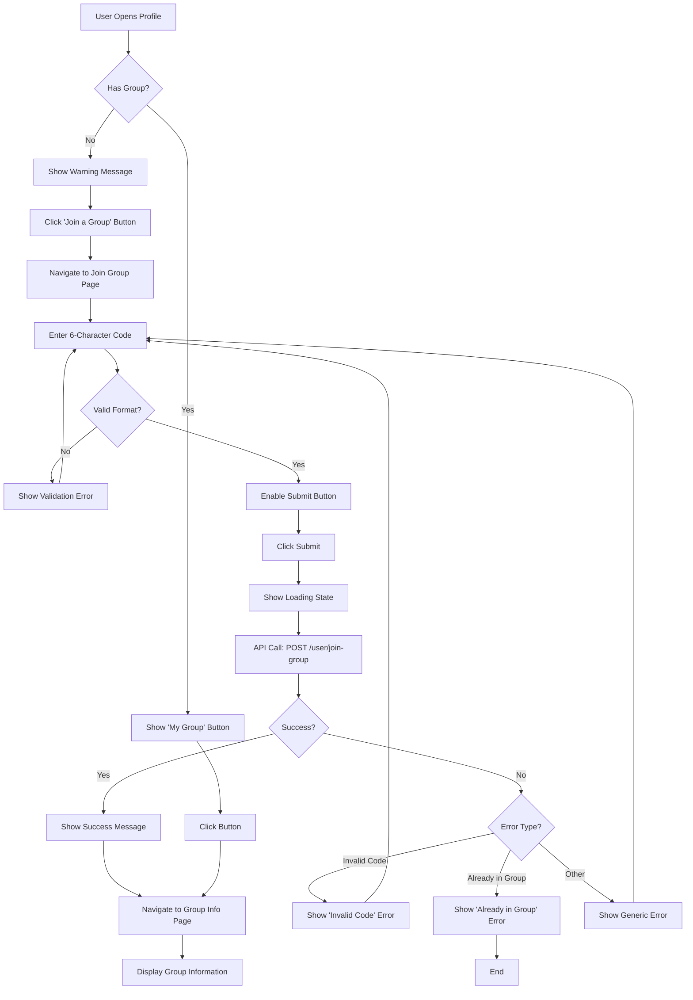
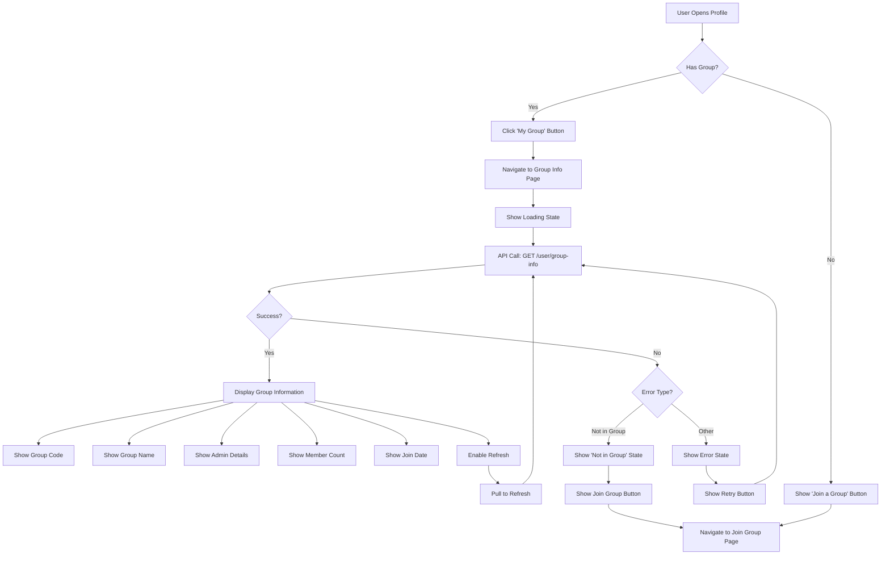
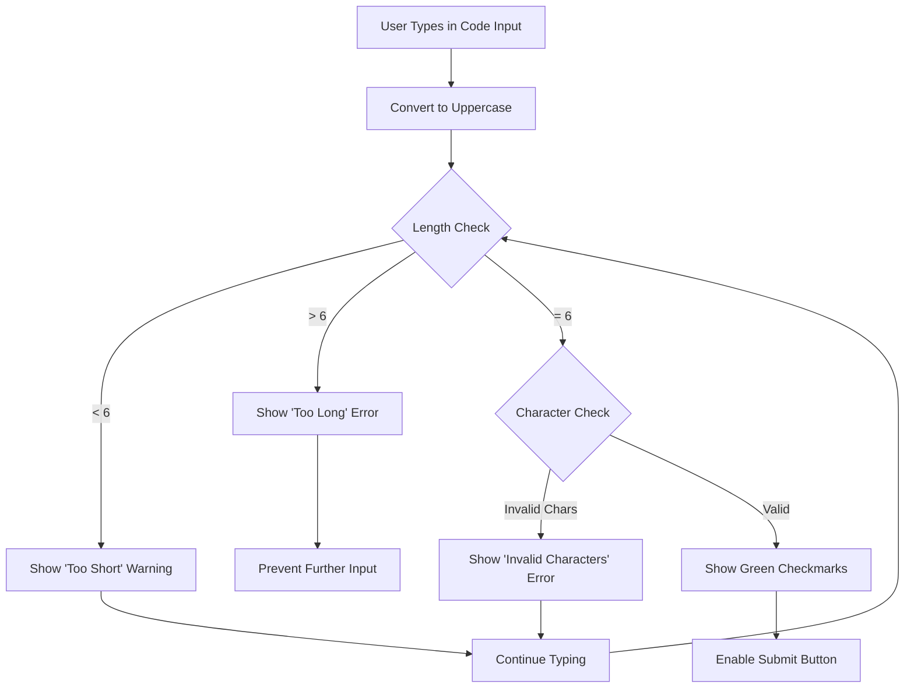
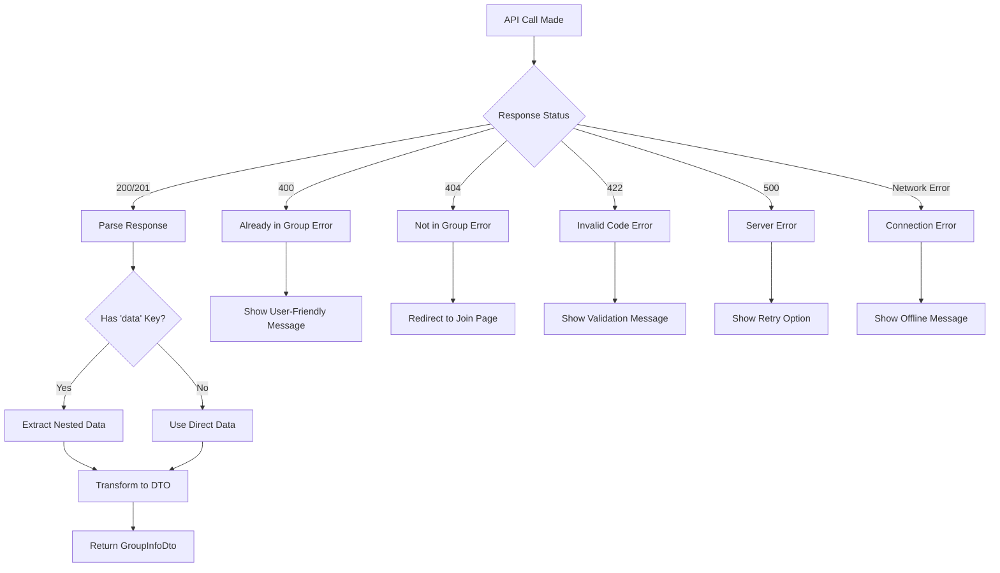
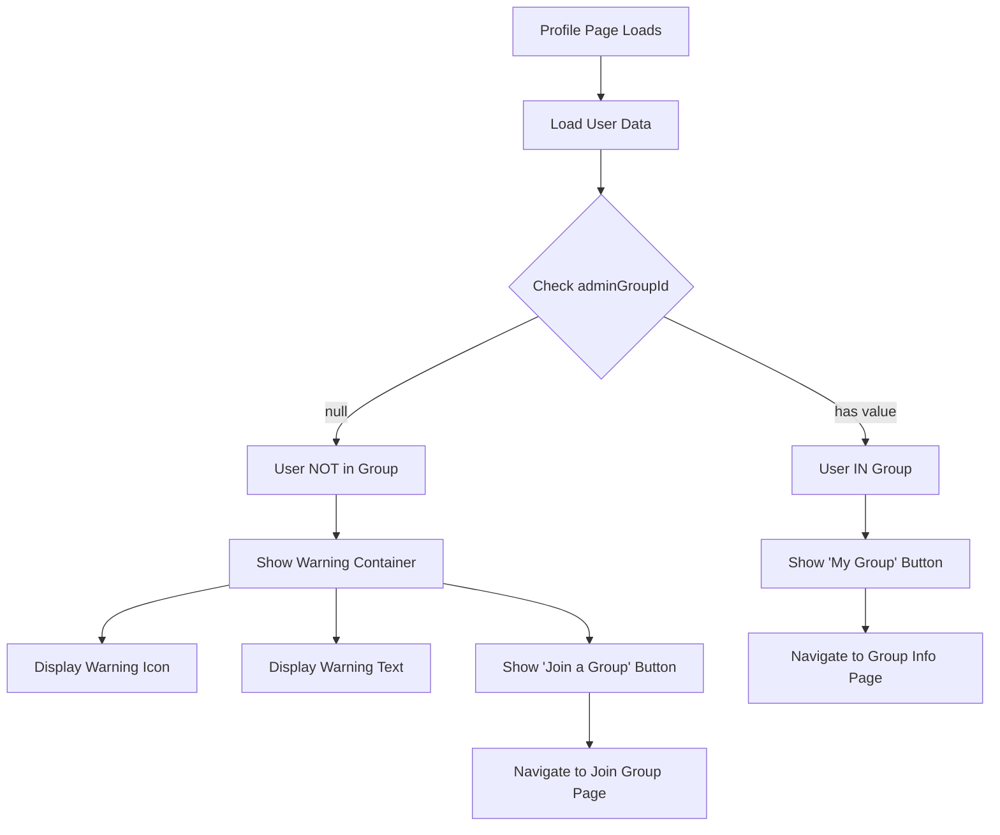
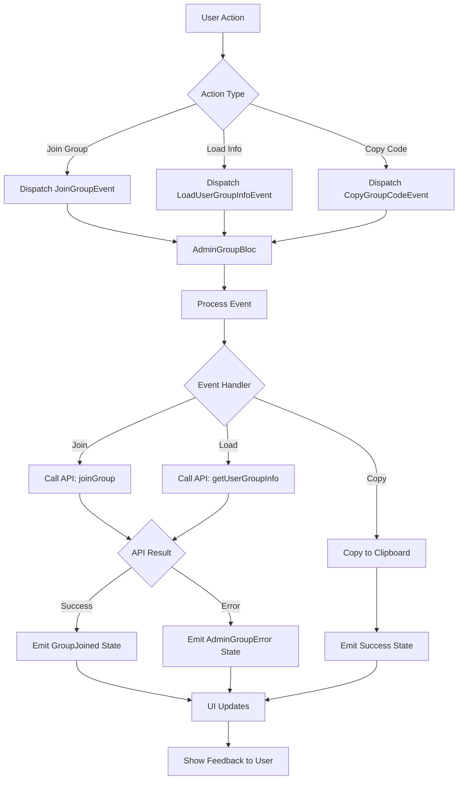
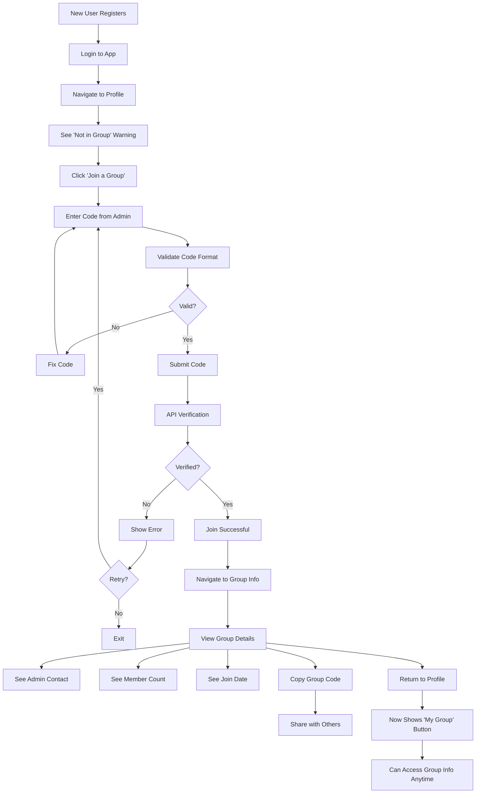
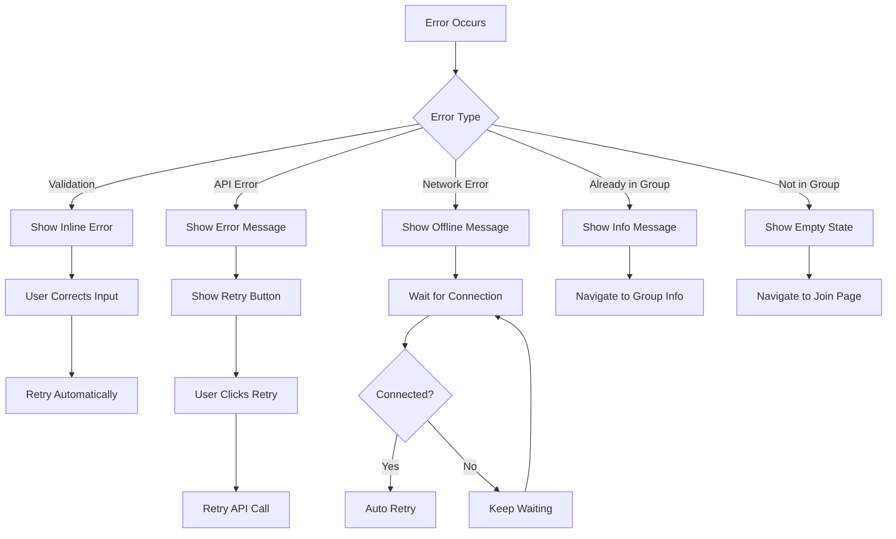
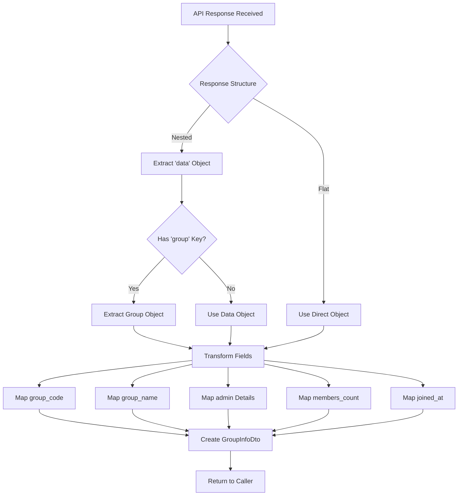
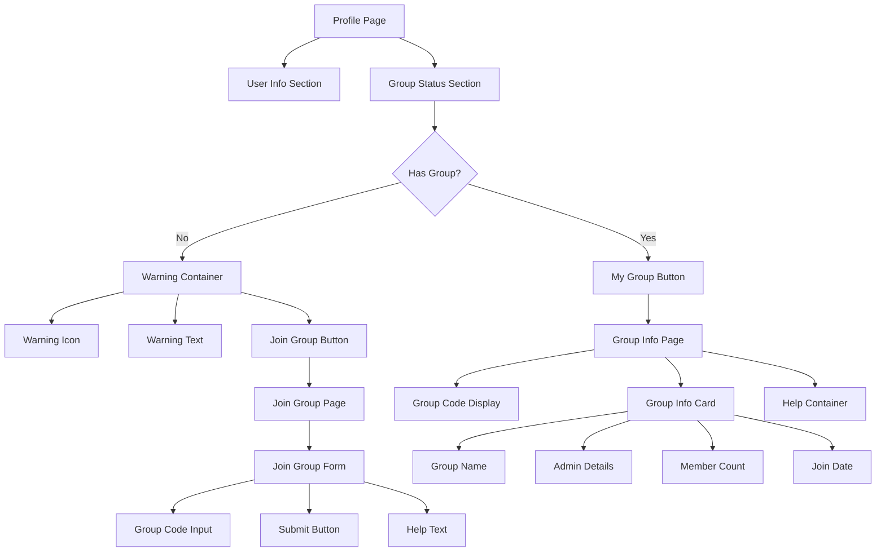

# User Group Information - Flow Diagrams

## Overview
Visual representation of the User Group Information feature flows.

---

## 1. Join Group Flow



---

## 2. View Group Info Flow



---

## 3. Group Code Validation Flow



---

## 4. API Error Handling Flow



---

## 5. Profile Integration Flow



---

## 6. State Management Flow



---

## 7. Complete User Journey



---

## 8. Error Recovery Flow



---

## 9. Data Transformation Flow



---

## 10. UI Component Hierarchy



---

## Key Interaction Points

### 1. Profile Page
- **Entry Point:** User navigates to profile
- **Decision Point:** Check if user has `adminGroupId`
- **Actions:** Show appropriate button (My Group or Join Group)

### 2. Join Group Page
- **Entry Point:** User clicks "Join a Group" button
- **Input:** 6-character group code
- **Validation:** Real-time format checking
- **Submission:** API call to join group
- **Success:** Navigate to Group Info page
- **Error:** Show error message and allow retry

### 3. Group Info Page
- **Entry Point:** User clicks "My Group" button or after successful join
- **Loading:** Fetch group information from API
- **Display:** Show all group details
- **Actions:** Refresh, copy code
- **Error:** Show error state with retry option

---

## State Transitions

```
Initial State
    ↓
[User Not in Group]
    ↓
User Clicks "Join Group"
    ↓
[Join Group Page]
    ↓
User Enters Code
    ↓
[Validating Code]
    ↓
User Submits
    ↓
[Loading - API Call]
    ↓
    ├─→ [Success] → [Group Joined] → [Group Info Page]
    └─→ [Error] → [Show Error] → [Retry or Exit]
```

---

## Navigation Map

```
Profile Page
    ├─→ Join Group Page (if not in group)
    │       └─→ Group Info Page (on success)
    └─→ Group Info Page (if in group)
            └─→ Profile Page (back button)
```

---

## Validation States

```
Empty Input
    ↓
User Types
    ↓
    ├─→ Length < 6: Show "Too Short" Warning
    ├─→ Length > 6: Prevent Input
    ├─→ Invalid Chars: Show "Invalid Characters" Error
    └─→ Length = 6 & Valid Chars: Show Success Indicators
```

---

## Error Handling Matrix

| Error Code | User Message | Action | Recovery |
|-----------|--------------|--------|----------|
| 400 | Already in a group | Show info | Navigate to group info |
| 404 | Not in any group | Show empty state | Navigate to join page |
| 422 | Invalid group code | Show error | Allow retry |
| 500 | Server error | Show error | Retry button |
| Network | Connection error | Show offline | Auto-retry on reconnect |

---

## Success Indicators

### Visual Feedback
1. ✅ Green checkmarks for valid requirements
2. 🔄 Loading spinner during API calls
3. ✔️ Success message after joining
4. 📋 Copy confirmation for group code

### State Changes
1. Button text changes (Join → My Group)
2. Warning disappears
3. Group info becomes accessible
4. Profile updates with group data

---

**Last Updated:** 2024
**Version:** 1.0
**Status:** Complete
