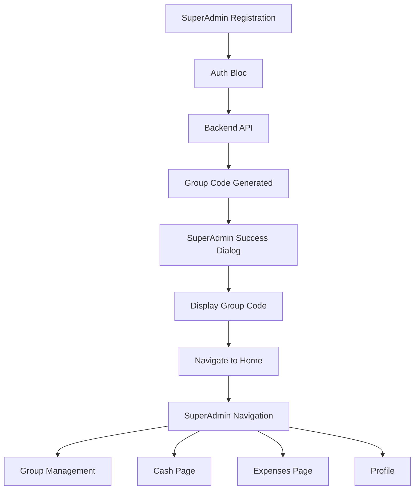

# Design Document

## Overview

This document outlines the technical design for customizing the SuperAdmin flavor of the Finance application. The design focuses on creating a distinct user experience for SuperAdmins by modifying the registration flow, consolidating UI pages, removing unnecessary features, and implementing aggregated expense monitoring across admin groups.

## Architecture

### High-Level Architecture

```
┌─────────────────────────────────────────────────────────────┐
│                    SuperAdmin Flavor                         │
├─────────────────────────────────────────────────────────────┤
│  Registration Flow                                           │
│  ├─ Auth Bloc (Modified)                                    │
│  ├─ SuperAdmin Registration Success Dialog (New)            │
│  └─ Group Code Display Widget (Reuse existing)              │
├─────────────────────────────────────────────────────────────┤
│  Navigation Structure                                        │
│  ├─ Group Management Page                                   │
│  ├─ SuperAdmin Cash Page (New/Modified)                     │
│  ├─ SuperAdmin Expenses Page (Modified)                     │
│  └─ Profile Page                                            │
├─────────────────────────────────────────────────────────────┤
│  Flavor Configuration                                        │
│  └─ FlavorConfig (Updated)                                  │
└─────────────────────────────────────────────────────────────┘
```

### Component Interaction Flow



## Components and Interfaces

### 1. SuperAdmin Registration Flow

#### 1.1 SuperAdmin Registration Success Dialog

**Purpose**: Display the generated group code immediately after successful registration.

**Location**: `lib/features/auth/presentation/widgets/superadmin_registration_success_dialog.dart`

**Interface**:
```dart
class SuperAdminRegistrationSuccessDialog extends StatelessWidget {
  final String groupCode;
  final String adminGroupName;
  
  const SuperAdminRegistrationSuccessDialog({
    required this.groupCode,
    required this.adminGroupName,
  });
}
```

**Features**:
- Prominent display of group code
- Copy-to-clipboard functionality
- Explanation text for sharing with admins
- Navigation to home after acknowledgment

#### 1.2 Auth Bloc Modification

**Changes Required**:
- Detect SuperAdmin flavor during registration
- Extract group code from registration response
- Emit state with group code for dialog display
- Handle navigation after dialog dismissal

### 2. SuperAdmin Cash Page

#### 2.1 Unified Cash Page

**Purpose**: Single page combining fund box display and outgoing transfer creation.

**Location**: `lib/ui/superadmin_cash_page.dart` (new file)

**Key Features**:
- Fund box balance display (USD)
- List of outgoing transfers to admins
- Create outgoing transfer button
- Transfer history filtered to outgoing only
- No incoming transfer section
- No exchange history section

**UI Structure**:
```
┌─────────────────────────────────────┐
│  SuperAdmin Cash                    │
├─────────────────────────────────────┤
│  Fund Box Balance: $X,XXX.XX        │
├─────────────────────────────────────┤
│  [+ Create Outgoing Transfer]       │
├─────────────────────────────────────┤
│  Outgoing Transfers                 │
│  ├─ Transfer to Admin 1             │
│  ├─ Transfer to Admin 2             │
│  └─ Transfer to Admin 3             │
└─────────────────────────────────────┘
```

**Data Flow**:
- Load fund box data for SuperAdmin
- Load transfers filtered by `type = 'outgoing'`
- Filter recipients to show only admins in SuperAdmin's group
- Create transfer with recipient selection from admin list

### 3. SuperAdmin Expenses Page

#### 3.1 Aggregated Expense View

**Purpose**: Display expense status from all admin groups under SuperAdmin supervision.

**Location**: `lib/ui/superadmin_expenses_page.dart` (new file)

**Key Features**:
- No "Add Expense" button
- Group-by-admin-group display
- Expense summaries per group
- Filtering by admin group
- Status indicators (pending, approved, rejected)
- Drill-down to detailed expenses per group
- Read-only view (no create/edit/delete)

**UI Structure**:
```
┌─────────────────────────────────────┐
│  Expenses Overview                  │
├─────────────────────────────────────┤
│  Filter: [All Groups ▼]             │
├─────────────────────────────────────┤
│  Admin Group 1                      │
│  ├─ Total: $X,XXX.XX                │
│  ├─ Count: XX expenses              │
│  ├─ Pending: X | Approved: X        │
│  └─ [View Details →]                │
├─────────────────────────────────────┤
│  Admin Group 2                      │
│  ├─ Total: $X,XXX.XX                │
│  ├─ Count: XX expenses              │
│  ├─ Pending: X | Approved: X        │
│  └─ [View Details →]                │
└─────────────────────────────────────┘
```

**Data Models**:

```dart
class AdminGroupExpenseSummary {
  final String adminGroupId;
  final String adminGroupName;
  final double totalAmount;
  final int expenseCount;
  final int pendingCount;
  final int approvedCount;
  final int rejectedCount;
}

class SuperAdminExpenseView {
  final List<AdminGroupExpenseSummary> groupSummaries;
  final double grandTotal;
  final int totalExpenseCount;
}
```

**API Endpoints Required**:
- `GET /api/superadmin/expenses/summary` - Get aggregated expense data
- `GET /api/superadmin/expenses/by-group/{groupId}` - Get detailed expenses for a group

### 4. Navigation Structure

#### 4.1 SuperAdmin Navigation Configuration

**Location**: `lib/main.dart` (HomeScaffold._buildPages method)

**Navigation Items** (in order):
1. Group Management (existing)
2. Cash (النقد) - SuperAdmin Cash Page
3. Expenses - SuperAdmin Expenses Page
4. Profile (existing)

**Removed Items**:
- Currency Exchange (تصريف)
- Export Page
- Exchange History
- User Cash Inbox (incoming transfers)

#### 4.2 FlavorConfig Updates

**Location**: `lib/core/config/flavor_config.dart`

**New Configuration Flags**:
```dart
final bool enableSuperAdminCashPage;
final bool enableSuperAdminExpensesPage;
final bool showIncomingTransfers;
final bool showExchangeHistory;
```

**SuperAdmin Configuration**:
```dart
FlavorConfig(
  flavor: AppFlavor.superAdmin,
  appName: 'Finance SuperAdmin',
  applicationId: 'com.app.finance.superadmin',
  enableCashModule: true,
  enableCashboxModule: false,
  enableCurrencyModule: false, // Disable exchange page
  enableExpensesModule: true,
  enableExportModule: false, // Disable export page
  requiresAdminRole: true,
  enableAdminDashboard: false,
  enableFundBox: true,
  enableAuditLogs: true,
  enableUserManagement: true,
  enableSuperAdminCashPage: true,
  enableSuperAdminExpensesPage: true,
  showIncomingTransfers: false,
  showExchangeHistory: false,
);
```

## Data Models

### 1. Registration Response Enhancement

**Current Model**: `AuthResponse`

**Enhancement Required**:
```dart
class AuthResponse {
  final User user;
  final String token;
  final String? groupCode; // Add for SuperAdmin
  final String? adminGroupName; // Add for SuperAdmin
  
  // ... existing fields
}
```

### 2. Transfer Filtering

**Enhancement**: Add transfer type filtering in TransferBloc

```dart
enum TransferType {
  incoming,
  outgoing,
  all,
}

class LoadTransfersEvent {
  final TransferType type;
  final String? userId;
}
```

### 3. Expense Summary Models

See section 3.1 for `AdminGroupExpenseSummary` and `SuperAdminExpenseView` models.

## Error Handling

### Registration Flow Errors

1. **Group Code Not Generated**
   - Fallback: Show success without group code, direct to group management
   - Log error for investigation
   - Display message: "Registration successful. Please check Group Management for your group code."

2. **Dialog Dismissal Without Copying**
   - Group code remains accessible in Group Management page
   - No blocking behavior

### Cash Page Errors

1. **Failed to Load Fund Box**
   - Display error message with retry button
   - Show cached data if available
   - Disable transfer creation until loaded

2. **Failed to Load Transfers**
   - Display error message with retry button
   - Show empty state with retry option

### Expenses Page Errors

1. **Failed to Load Expense Summary**
   - Display error message with retry button
   - Show cached data if available

2. **Failed to Load Group Details**
   - Display error message in detail view
   - Allow navigation back to summary

## Testing Strategy

### Unit Tests

1. **FlavorConfig Tests**
   - Verify SuperAdmin configuration flags
   - Test navigation item generation based on flags

2. **SuperAdmin Cash Page Tests**
   - Test transfer filtering (outgoing only)
   - Test recipient filtering (admins only)
   - Test fund box display

3. **SuperAdmin Expenses Page Tests**
   - Test expense summary aggregation
   - Test group filtering
   - Test drill-down navigation

### Widget Tests

1. **SuperAdmin Registration Success Dialog**
   - Test group code display
   - Test copy-to-clipboard functionality
   - Test navigation after dismissal

2. **SuperAdmin Cash Page**
   - Test UI rendering with mock data
   - Test empty states
   - Test error states

3. **SuperAdmin Expenses Page**
   - Test summary card rendering
   - Test filtering functionality
   - Test navigation to details

### Integration Tests

1. **Registration Flow**
   - Test complete registration with group code generation
   - Test dialog display and dismissal
   - Test navigation to home

2. **Cash Page Flow**
   - Test loading fund box and transfers
   - Test creating outgoing transfer
   - Test transfer list updates

3. **Expenses Page Flow**
   - Test loading expense summaries
   - Test filtering by group
   - Test drill-down to details

## UI/UX Considerations

### Visual Design

1. **Consistency**: Maintain existing app theme and color scheme
2. **Clarity**: Clear labeling for SuperAdmin-specific features
3. **Accessibility**: Proper contrast ratios, touch targets, and screen reader support

### User Flow

1. **Registration**: Immediate group code display prevents confusion
2. **Cash Management**: Simplified view focuses on outgoing transfers only
3. **Expense Monitoring**: Aggregated view provides quick overview with drill-down capability

### Localization

All new UI elements must support Arabic and English:
- SuperAdmin registration success dialog
- Cash page labels
- Expenses page labels
- Navigation items

**Required Translation Keys**:
```
superadmin_registration_success
group_code_generated
share_with_admins
copy_group_code
outgoing_transfers
create_outgoing_transfer
expense_overview
admin_group_summary
view_group_details
total_expenses
pending_expenses
approved_expenses
rejected_expenses
```

## Performance Considerations

### Caching Strategy

1. **Expense Summaries**: Cache for 5 minutes, refresh on pull-to-refresh
2. **Transfer List**: Cache for 2 minutes, refresh on page focus
3. **Fund Box**: Cache for 1 minute, refresh on page focus

### Pagination

1. **Transfer List**: Paginate at 20 items per page
2. **Expense Details**: Paginate at 50 items per page

### Lazy Loading

1. **Expense Details**: Load only when user drills down into a group
2. **Transfer History**: Load incrementally as user scrolls

## Security Considerations

### Authorization

1. **SuperAdmin-Only Pages**: Verify flavor and user role before rendering
2. **API Endpoints**: Backend must verify SuperAdmin role for all SuperAdmin-specific endpoints
3. **Group Code Access**: Only SuperAdmin can view their own group code

### Data Isolation

1. **Expense Data**: SuperAdmin sees only expenses from their managed admin groups
2. **Transfer Data**: SuperAdmin sees only their own outgoing transfers
3. **Group Members**: SuperAdmin sees only admins in their group

## Migration Strategy

### Existing SuperAdmin Users

1. **Group Code**: If SuperAdmin already registered, generate group code on first login
2. **Navigation**: Automatically redirect to new SuperAdmin pages
3. **Data**: No data migration required, only UI changes

### Rollback Plan

1. **Feature Flags**: Use flavor config to enable/disable SuperAdmin features
2. **Backward Compatibility**: Keep existing pages functional for other flavors
3. **Database**: No schema changes required for this feature

## Dependencies

### Existing Components to Reuse

1. **GroupCodeDisplay** widget (from admin-group-management-integration)
2. **FundBoxBloc** (existing)
3. **TransferBloc** (existing, with modifications)
4. **ExpenseBloc** (existing, with modifications)
5. **AdminGroupBloc** (existing)

### New Dependencies

None required - all functionality can be implemented with existing packages.

## Implementation Notes

### Phase 1: Registration Flow
- Modify AuthBloc to handle SuperAdmin registration
- Create SuperAdminRegistrationSuccessDialog
- Update registration page to show dialog

### Phase 2: Navigation & Config
- Update FlavorConfig with SuperAdmin flags
- Modify HomeScaffold to build SuperAdmin navigation
- Remove unwanted pages from navigation

### Phase 3: Cash Page
- Create SuperAdminCashPage
- Implement transfer filtering
- Implement recipient filtering (admins only)

### Phase 4: Expenses Page
- Create SuperAdminExpensesPage
- Implement expense summary API integration
- Implement group filtering and drill-down

### Phase 5: Testing & Polish
- Write unit tests
- Write widget tests
- Write integration tests
- Add localization
- Polish UI/UX
